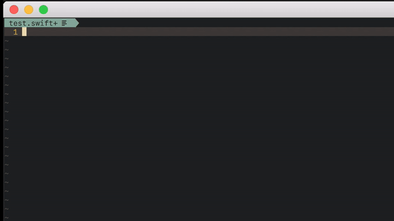

## Introduction

Swift completion for [NCM](https://github.com/roxma/nvim-completion-manager),
based on the [SourceKitten framework](https://github.com/jpsim/SourceKitten).



## Requirements

- Install and config [SourceKitten](https://github.com/jpsim/SourceKitten#installation)

## vimrc example

```vim

Plug 'roxma/nvim-completion-manager'

" swift
Plug 'dafufer/nvim-cm-swift-completer'

```

## jump to placeholders

```vim

autocmd FileType swift nmap <buffer> <C-k> <Plug>(swift_completer_jump_to_placeholder)
autocmd FileType swift imap <buffer> <C-k> <Plug>(swift_completer_jump_to_placeholder)

```

## setting custom target and SDK, and a SPM Module to read flags from it

```vim
" this variables can also be set specifically for a buffer by using b: instead of g:
let g:swift_completer_sdk = '/Applications/Xcode.app/Contents/Developer/Platforms/iPhoneOS.platform/Developer/SDKs/iPhoneOS9.0.sdk' "
let g:swift_completer_target = 'arm64-apple-ios9.0' 
let g:swift_completer_spm_module = 'Test' 

```
